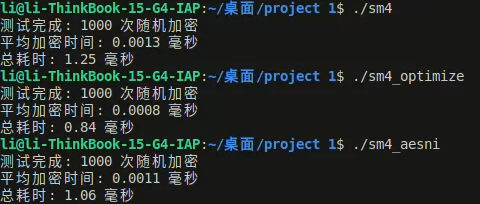
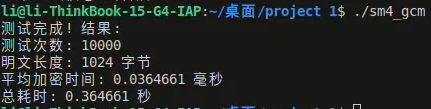

# SM4的软件实现和优化

## 优化SM4的软件执行效率

### T-table优化

SM4算法的轮函数F包含非线性变换 $\tau$ 与线性变换 $L$ 

非线性变换接收4个字节的输入，记为 $A=(a_0,a_1,a_2,a_3)$ ，输出4个字节的结果，记为 $B=(b_1,b_2,b_3,b_4)$ 
$B=\tau (A)=(Sbox(a_1),Sbox(a_2),Sbox(a_3),Sbox(a_4))$

线性变换 $L(B)=B \oplus (B <<< 2) \oplus (B <<< 10) \oplus (B <<< 18) \oplus (B <<< 24)$

若单独考虑每一字节，将过S盒与线性变换进行合并，通过构建四个大小为 $16 \times 16$ 每个元素32bit的T表，即可加速轮函数的计算

用于计算T表的代码如下：

```cpp
    word32 T4[16][16];
    for(int i = 0; i < 16; i++)
    {
        for(int j = 0; j < 16; j++)
        {
            T4[i][j]= ((word32)Sbox[i][j]) ^ rotl((word32)Sbox[i][j], 2) ^ rotl((word32)Sbox[i][j], 10) ^ rotl((word32)Sbox[i][j], 18) ^ rotl((word32)Sbox[i][j], 24);
        }
    }

    for(int i = 0; i < 16; i++)
    {
        for(int j = 0; j < 16; j++)
        {
            cout<< hex <<"0x"<< T4[i][j] << ", ";
        }
        cout << endl;
    }
```

### AESNI优化

SIMD(Single Instruction Multiple Data)即单指令流多数据流，是一种采用一个控制器来控制多个处理器，同时对一组数据（又称“数据向量”）中的每一个分别执行相同的操作从而实现空间上的并行性的技术。简单来说就是一个指令能够同时处理多个数据。

基本思想是利用SM4与AES中S盒结构的相似性，借助intel的AESNI指令完成S盒操作

算法流程：因为AESNI指令操作的是128bit的数据，SM4一组消息每轮需要查表的数据仅有32bit，故将4组消息打包至一块，使得处理数据内容达到128bit

1. 输入消息 $M_0,M_1,M_2,M_3$
2. $X_0,X_1,X_2,X_3 \leftarrow$ 分组打包 $(M_0,M_1,M_2,M_3)$
3. **for** $i=0\rightarrow 31$
4. &nbsp;&nbsp; $S\leftarrow X_1 \oplus X_2 \oplus X_3 \oplus K_i$
5. &nbsp;&nbsp; $S\leftarrow TA \times S + TC$
6. &nbsp;&nbsp; $S\leftarrow$ AES S盒 $(S)$
7. &nbsp;&nbsp; $S\leftarrow ATA \times S + ATAC$
8. &nbsp;&nbsp; $S\leftarrow X_0 \oplus L(S)$
9. &nbsp;&nbsp; $X_0, X_1, X_2, X_3 \leftarrow X_1, X_2, X_3, S$
10. $M_0,M_1,M_2,M_3 \leftarrow$ 分组解包 $(X_0,X_1,X_2,X_3)$
11. 输出 $M_0,M_1,M_2,M_3$

运行效率对比：



|  算法 | 时间  |
|  ----  | ----  |
| 无优化SM4  | 1.3us |
| T-table优化SM4  | 0.8us |
| AESNI优化SM4 | 1.1us |

## SM4-GCM工作模式的软件优化实现

**SM4-GCM**（Galois/Counter Mode）是一种结合了 **CTR（计数器）模式加密** 和 **GMAC（Galois 消息认证码）** 的工作模式，提供 **加密 + 认证** 功能，且能够支持并行计算

SM4-GCM 使用 **SM4 分组密码**（128 比特分组）作为底层加密算法，流程如下：

### （1）初始化

- 输入：
  - **密钥 K**（128 比特）
  - **初始向量 IV**（通常 96 比特，但可调整）
  - **附加认证数据 AAD**（可选，不加密但参与认证）
  - **明文 P**（待加密数据）
- 计算初始计数器：
  - 如果 IV 是 96 比特，则直接拼接 `IV || 0x00000001` 作为初始计数器 J₀
  - 否则，计算 J₀ = GHASH(IV || padding)

### （2）加密（CTR 模式）

- 生成密钥流：
  - 计算 CTRᵢ = J₀ + i（计数器递增）
  - 用 SM4 加密 CTRᵢ 得到密钥流块 E_K(CTRᵢ)
- 加密明文：
  - 密文 Cᵢ = Pᵢ ⊕ E_K(CTRᵢ)

### （3）认证（GMAC）

- 计算认证标签 T：
  - 构造输入数据：`AAD || C || len(AAD) || len(C)`（填充对齐 128 比特）
  - 使用 **GHASH 函数**（Galois 域乘法）计算哈希值 H：
    - H = E_K(0¹²⁸)（SM4 加密全 0 块）
    - GHASH 计算方式类似于多项式哈希，在 GF(2¹²⁸) 上进行乘法运算
  - 最终认证标签：
    - T = GHASH(H, AAD, C) ⊕ E_K(J₀)

### （4）输出

- **密文 C**  
- **认证标签 T**（通常 128 比特，可截断为 96/64 比特）

---

解密过程与加密类似，但需先验证认证标签：

1. 使用相同的 K, IV 重新计算 T'（GMAC）
2. 比较接收到的 T 和计算的 T'，如果不同则拒绝解密
3. 如果认证通过，则用 CTR 模式解密 C 得到明文 P

SM4-GCM工作模式的软件优化实现效率：


