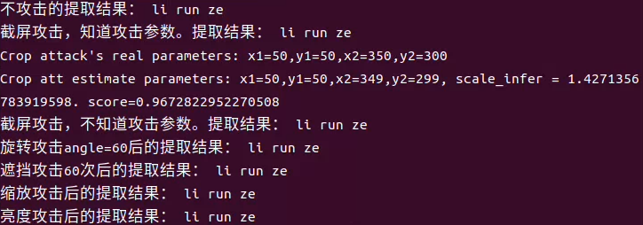

# 数字水印嵌入和提取

使用开源的blind-watermark库进行数字水印嵌入和提取，其为基于基于频域的

## 安装

在命令行输入：

```shell
pip install blind-watermark
```

## python中使用

原图 + 水印 = 打上水印的图

 + 'li run ze' = `

参考 [代码](./example.py)

代码运行结果：



嵌入水印
```python
from blind_watermark import WaterMark

bwm1 = WaterMark(password_img=1, password_wm=1)
bwm1.read_img('pic/image.jpg')
wm = 'li run ze'
bwm1.read_wm(wm, mode='str')
bwm1.embed('output/embedded.png')
len_wm = len(bwm1.wm_bit)
print('Put down the length of wm_bit {len_wm}'.format(len_wm=len_wm))
```


提取水印
```python
bwm1 = WaterMark(password_img=1, password_wm=1)
wm_extract = bwm1.extract('output/embedded.png', wm_shape=len_wm, mode='str')
print(wm_extract)
```
Output:
>li run ze

|攻击方式|攻击后的图片|提取的水印|
|--|--|--|
|亮度攻击||'li run ze'|
|多遮挡攻击||'li run ze'|
|截屏攻击1||'li run ze'|
|截屏攻击2||'li run ze'|
|旋转攻击||'li run ze'|
|缩放攻击||'li run ze'|
